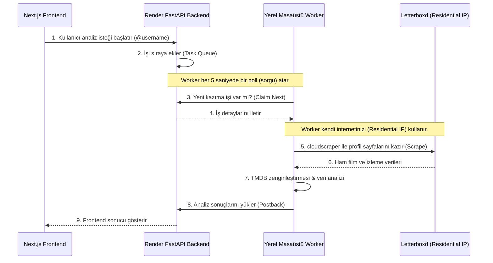

# 🖥️ Letterboxd Wrapped — Masaüstü Scrape Worker Rehberi

Bu kılavuz, **Movies Wrapped** projesinin en kritik bileşenlerinden biri olan ve yerel masaüstü bilgisayarınızda çalışan **Desktop Scrape Worker** sisteminin çalışma mantığını, kullanım kurallarını, güvenlik detaylarını ve işletim (kapatma/açma/güncelleme) süreçlerini detaylandırmaktadır.

---

## 🧭 1. Sistem Nasıl Çalışıyor? (Mimari Mantık)

Render gibi bulut platformlarının IP adresleri, Letterboxd ve TMDB gibi servisler tarafından (veri merkezi/datacenter IP bloğu olduğu için) sıklıkla engellenir veya yüksek oranda rate-limit'e tabi tutulur. 

Bu engelleri aşmak için hibrit bir mimari kurulmuştur:

### 📦 Outbox Güvencesi (Çevrimdışı Koruma)
Worker çalışırken internetiniz koparsa veya Render backend sunucusu yeniden başlarsa analizi yapılan veriler kaybolmaz:
* Tamamlanan iş yerel diskte `.worker_outbox/` klasörü altına geçici bir `.json` olarak kaydedilir.
* Bağlantı geri geldiğinde worker bu outbox klasöründeki kuyruğu otomatik olarak eritip Render sunucusuna iletir.

---

## ⚙️ 2. Bilgisayar Kapatılıp Açıldığında Ne Olur?

Bilgisayarınızı kapatıp açmanız **sistem için tamamen güvenlidir** ve herhangi bir veri bozulmasına yol açmaz. Ancak sistemin kesintisiz çalışabilmesi için worker'ın tekrar aktif olması gerekir.

### Sadece `.bat` Dosyasını Çalıştırmak Yeterli mi?
**Evet, yeterlidir.** Çift tıkladığınızda çalışan `.bat` dosyası arka planda Python sanal ortamını devreye sokar ve worker'ı ayağa kaldırır.

### Kapatıp Açınca Bir Şey Olur mu?
* **Olmaz.** Sunucu (Render), worker'dan heartbeat (nabız) almayı durdurduğunda dashboard üzerinde durumunu `Offline` olarak günceller.
* O sırada gelen analiz istekleri sıraya alınır (kuyrukta bekler).
* Bilgisayarınızı açıp worker'ı tekrar başlattığınızda, kuyrukta bekleyen tüm işler sırayla çekilip işlenmeye devam eder.

### Windows Açılışında Otomatik Başlatma
Eğer bilgisayar açıldığında `.bat` dosyasının kendiliğinden başlamasını istiyorsanız, **Görev Zamanlayıcı (Task Scheduler)** kurulumunu yapmanız önerilir:
1. Başlat menüsüne **Task Scheduler** yazıp açın.
2. **Temel Görev Oluştur** seçeneğiyle bilgisayar açıldığında veya oturum açtığınızda çalışacak bir eylem ekleyin.
3. Çalıştırılacak program olarak masaüstünüzdeki `start_letterboxd_worker.bat` dosyasını gösterin.
4. Görev ayarlarından **"Run with highest privileges"** ve hata durumunda **"Açılışta çökerse 1 dakika sonra tekrar dene"** seçeneklerini aktifleştirin.

---

## 🚫 3. Desktop Tarafında Yapılması ve Yapılmaması Gerekenler

### 🟢 Yapılması Gerekenler (Dos)
1. **Kod Güncellemelerinden Sonra `.bat` Dosyasını Yeniden Başlatın**: Repo üzerinde `git pull` çektiğinizde yeni kodların devreye girmesi için açık olan siyah terminal penceresini kapatıp `.bat` dosyasını yeniden çalıştırmalısınız.
2. **TMDB_API_KEY ve WORKER_TOKEN Değerlerini `.env` İçinde Tutun**: Masaüstündeki `backend/.env` dosyasında `TMDB_API_KEY` ve Render ile eşleşen `WORKER_TOKEN` değerlerinin doğru girildiğinden emin olun.
3. **Güç Seçeneklerini Ayarlayın**: Kod içerisinde Windows uyku kilidi (wakelock) yerleşiktir; ancak bilgisayarınızın kapak kapatma eylemleri veya derin uyku ayarları Python'u askıya alabilir. Masaüstü cihazınızın otomatik olarak tamamen kapanmadığından emin olun.

### 🔴 Yapılmaması Gerekenler (Don'ts)
1. **`.env` Dosyasına `SCRAPER_API_KEY` Eklemeyin**: Eğer bu anahtar tanımlı olursa worker kendi yerel IP'niz yerine ücretli harici proxy kullanmaya çalışır. Masaüstü worker'ın amacı zaten kendi ev internetiniz (residential) üzerinden ücretsiz kazımaktır.
2. **Aynı Token ile Birden Fazla Worker Çalıştırmayın**: Aynı anda aynı bilgisayarda veya farklı makinelerde birden fazla worker başlatmak, Letterboxd tarafında IP engellemesine (rate-limit) sebep olabilir.
3. **Admin Dashboard Şifresini (`ADMIN_SECRET`) Boş Bırakmayın**: `admin.py` içerisindeki yedek fallback şifresi yerine Render üzerinde güçlü ve benzersiz bir `ADMIN_SECRET` tanımladığınızdan emin olun.

---

## 🛠️ 4. Sık Karşılaşılan Sorunlar ve Çözümleri

| Sorun | Neden Olur? | Çözüm |
| :--- | :--- | :--- |
| **HTTP 401 Unauthorized** | Yerel `.env` içindeki `WORKER_TOKEN` ile Render'daki uyuşmuyor. | İki taraftaki token değerinin de birebir aynı olduğunu kontrol edin ve Render backend'i yeniden deploy edin. |
| **HTTP 404 Not Found** | Render backend henüz `desktop_server` branch'ine güncellenmedi. | Render üzerindeki backend reposunun `desktop_server` branch'inden güncel sürümle derlendiğinden emin olun. |
| **UnicodeDecodeError** | Loglarda veya film detaylarında Türkçe/özel karakterlerin okunması Windows yerel diline takılıyor. | `.bat` dosyasının ilk satırlarında `set PYTHONUTF8=1` tanımının olduğunu doğrulayın. (Bunu son güncellemede optimize ettik). |

---

> [!TIP]
> Masaüstü worker'ın canlı durumunu, son heartbeat süresini ve kazıma metriklerini şu adresteki admin panelinden canlı takip edebilirsiniz:  
> `https://wrapped-backend.onrender.com/admin/dashboard?key=ADMIN_SECRETINIZ`
